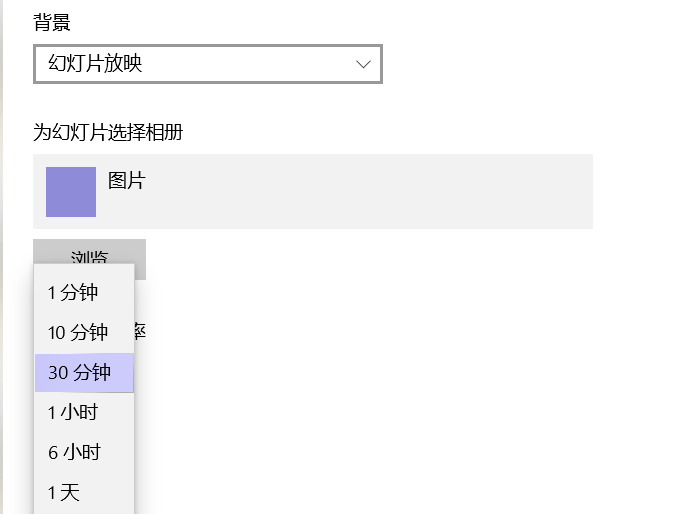

# 软件需求规格说明书
## 1. 问题定义

由于最近一段时间课程数量比较密集，所以我直接把课程表的截图当作壁纸了。这时候有人就提出：**能不能动态地切换壁纸？**这是因为每一周的课程表都可能是不同的，如果能自动切换壁纸，那么能省去我们很多的麻烦。

## 2. 可行性分析

其实**Windows是支持壁纸的自动切换的**。如果是单纯地实现每隔一定时间切换壁纸地软件，无异于是白用工。

然而它的提供的功能十分有限，仅**支持一定时间间隔的壁纸切换**：

如果我们的目标是能够使用类似Linux crontab表达式这么强大的计划任务来切换壁纸，那么这个主意确实可行。

## 3. 需求分析

为了实现**低耦合，高内聚**的要求，我们把这个任务分解成了三个大的模块：

1.  为了让所有的用户都能使用，我们得制作友好的**图形界面**。
2.  为了有计划地切换壁纸，我们得在后台开一个进程，这个进程**能实现类似Linux crontab的计划任务**。
3.  **切换壁纸**的一个程序，由2中的进程到规定时间后调用。

## 4. 概要设计

### 4.1. 图形界面

#### (1). 导航栏

现在桌面应用web化已经成为一个趋势。我们希望我们的软件能够做得成熟一点，那一个窗口很有可能就放不下我们所有的功能。参考很多网站都有导航栏的功能，所以我们希望我们不同的功能能放在不同的页面中，然后我们可以通过导航栏来跳转到相应的页面。

#### (2). 轮播图

这是一个与图片有关的桌面应用。很显然用户为了切换壁纸，得选择大量的图片，我们可以把这些图片，以轮播图的形式展示出来。

#### (3). 开启进程

用户在使用GUI的时候，后台实际上得与其它模块进行交互。其中最重要的，就是当用户挑选完壁纸，点击“开始切换”按钮，然后壁纸就开始自动切换。

### 4.2. 计划任务程序

win32API提供的Task的接口的功能十分有限，而且用起来也不方便（但是性能却出奇地好），比如它只提供了时间间隔的接口，但是没有提供时间点的接口。这让一些功能，比如每周一自动更新，编写变得很复杂。我必须根据用户提供的不同时间点的模式，计算出TaskSheduler的起始时间，再利用时间间隔实现。

所以，我们必须自己寻找或者编写，一个能够解析crontab表达式，并能根据解析的结果设定计划任务的包。另外，我们这个进程**在我们界面关闭的时候也不会停止**。甚至按照计划任务的定义，这个**进程在电脑重启**的时候也能开启。所以我们可以创建一个Windows的服务。

### 4.3. 壁纸切换

为了解耦我们特地把壁纸切换的程序也给单独拿出来了，由于它作为一个单独的程序存在，我们需要让它实现两个需求：

1. **切换壁纸**的需求，这点不必多说。
2. **记录自己被执行的次数**，然后我们可以根据这个次数选择壁纸。

## 5. 详细设计

### 5.1 . 图形界面

这里我们选择**WPF**作为我们图形界面的框架，这主要是考虑到WPF作为一个成熟的框架，之前的几个关于图形界面的需求能够轻松实现。另外，由于我们专注于windows电脑端，没有跨平台的需求，从这个前提出发，WPF是我们的不二选择。

### 5.2. 计划任务程序

为了实现计划任务的需求，我们经过了多次比对，最终选择了**Quartz**作为我们的框架。我们通过封装它的API，就能实现简易的Linux计划任务需求。

如果是要创建服务的话，我们可以在vs中**创建windows服务**的项目。

### 5.3 壁纸切换

切换壁纸我们可以直接使用**win32API**。为了获取图片，我们可以在图形界面中用json保存各个图片的路径，在本模块中解析json，获得图片。导出和加载json的包我们选择的是**NewtonSoft.Json**

记录被执行的次数有点复杂，一个简单的想法就是通过环境变量写入系统，然后再获取环境变量获取执行的次数。

