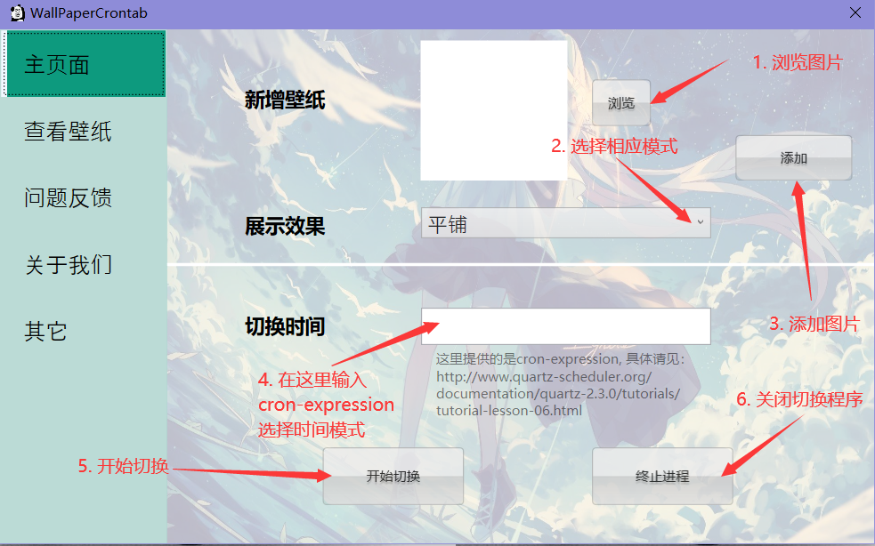
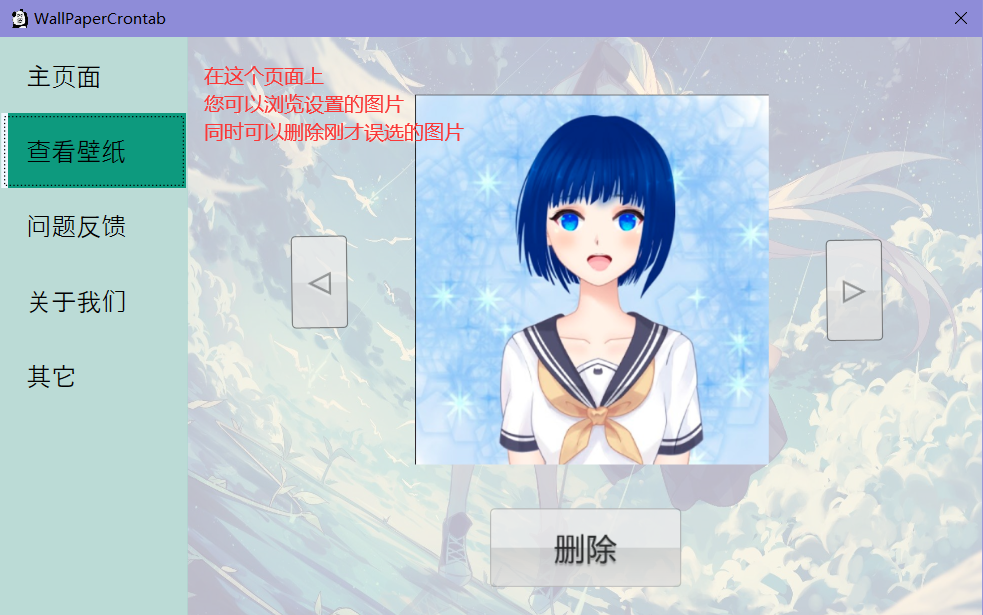
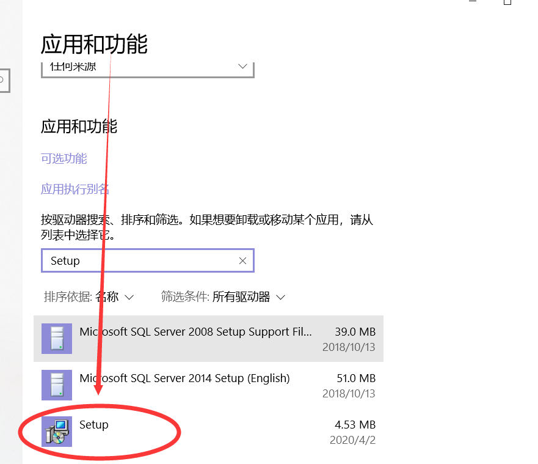

# wallpaper automation用户手册

## 一. 下载

在`github release`中下载最新最稳定的版本的压缩包-->[传送门](https://github.com/Sh-Zh-7/wallpaper-automation/releases)。

双击`Setup.exe`进行安装使用。

## 二. 使用说明

设置一个切桌面的计划任务步骤如下所示：

如果你想要查看或者删除你已经添加的图片，你可以在下面的页面中操作：

## 三. 卸载

如果你想卸载本款应用，在`应用和功能`页面中找到`Setup`并卸载：

## 四. 问题反馈与帮助改进代码

该款应用内部就有问题反馈的相关链接。这里不再赘述。

详细的请见这里–>[传送门](./CONTRIBUTING.md)
